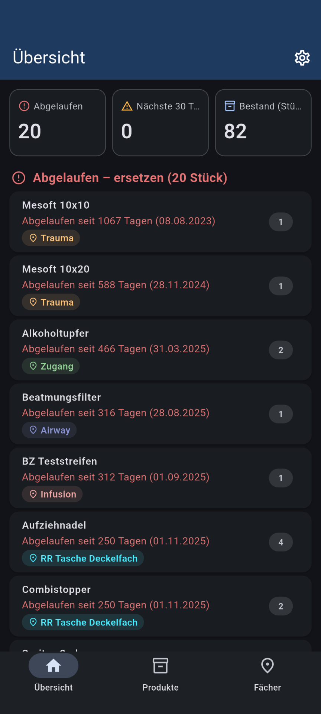
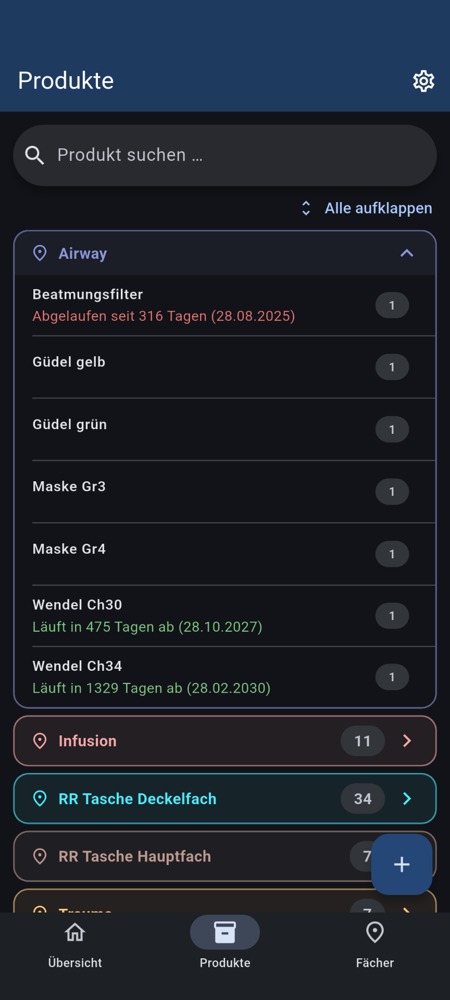
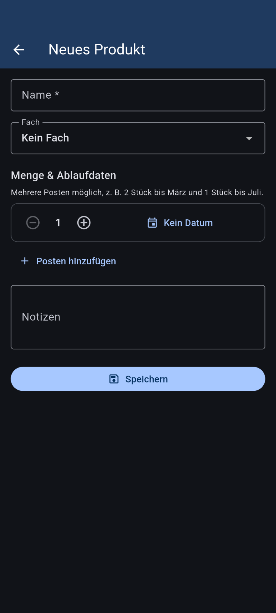

# Inventar

Behalte deinen Vorrat im Blick: Produkte erfassen, Fächern zuordnen und Ablaufdaten verwalten. Die App zeigt dir, was als Nächstes abläuft und was ersetzt werden muss — und erinnert dich rechtzeitig per Benachrichtigung.

  
  
  

## Funktionen

- 📊 **Übersicht mit Dashboard** — auf einen Blick: was ist abgelaufen, was läuft bald ab, wie groß ist der Bestand
- 📦 **Produkte mit mehreren Posten** — pro Produkt beliebig viele Mengen mit eigenem Ablaufdatum (z. B. 2 Stück bis März, 1 Stück bis Juli)
- 🗂️ **Farbige Fächer** — Produkte nach Aufbewahrungsort ordnen (z. B. Kühlschrank, Keller, Rucksack), als aufklappbare Karten mit Suche
- 🔔 **Erinnerungen** — Benachrichtigung vor dem Ablauf und am Ablauftag; Vorlauf, Uhrzeit und Warnschwelle frei einstellbar
- 💾 **Export & Import** — alle Daten als JSON-Datei sichern und wiederherstellen, z. B. beim Gerätewechsel
- 🌙 Helles und dunkles Design

## Installation

Die aktuelle Version gibt es unter [Releases](https://github.com/schnarchler/Inventar-App/releases). Für die meisten Geräte (alle Pixel- und aktuellen Samsung-Modelle) ist **`app-arm64-v8a-release.apk`** die richtige Datei; `armeabi-v7a` ist für ältere Geräte.

Benötigt wird Android 5.0 oder neuer. Beim ersten Start fragt die App nach der Berechtigung für Benachrichtigungen.

## Datenschutz

Alle Daten bleiben **lokal auf deinem Gerät** in einer SQLite-Datenbank. Kein Konto, keine Werbung, kein Tracking — die App hat nicht einmal eine Internetberechtigung.

## Lizenz

[MIT](LICENSE)
